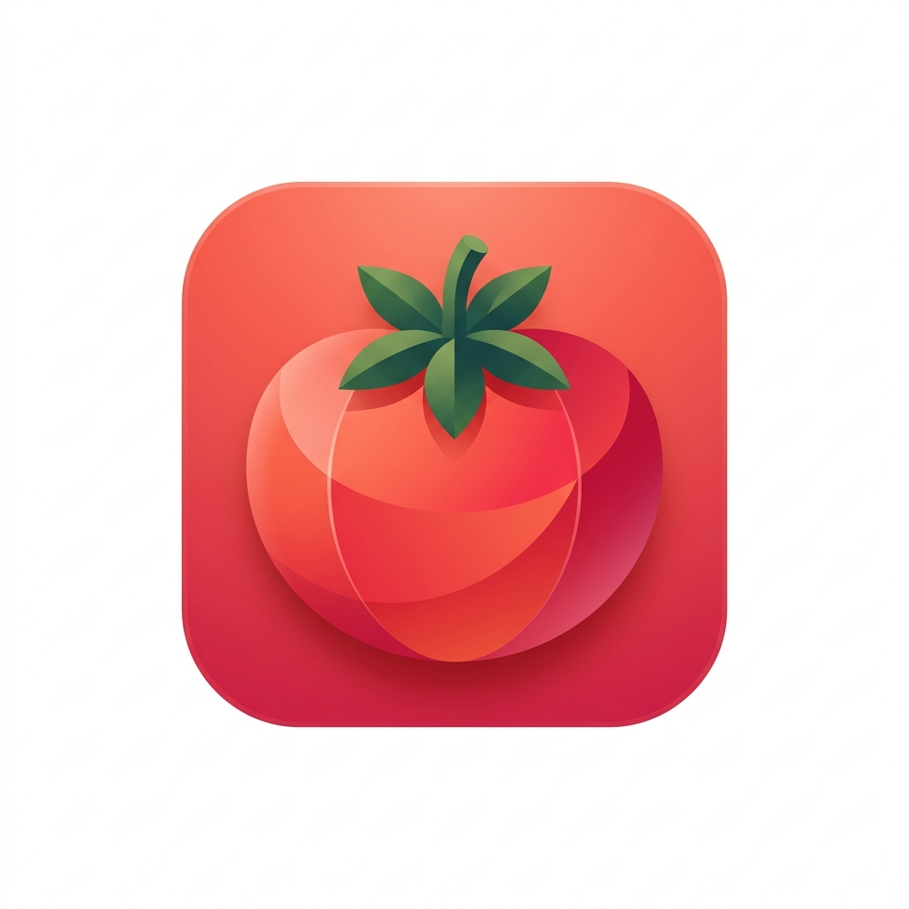
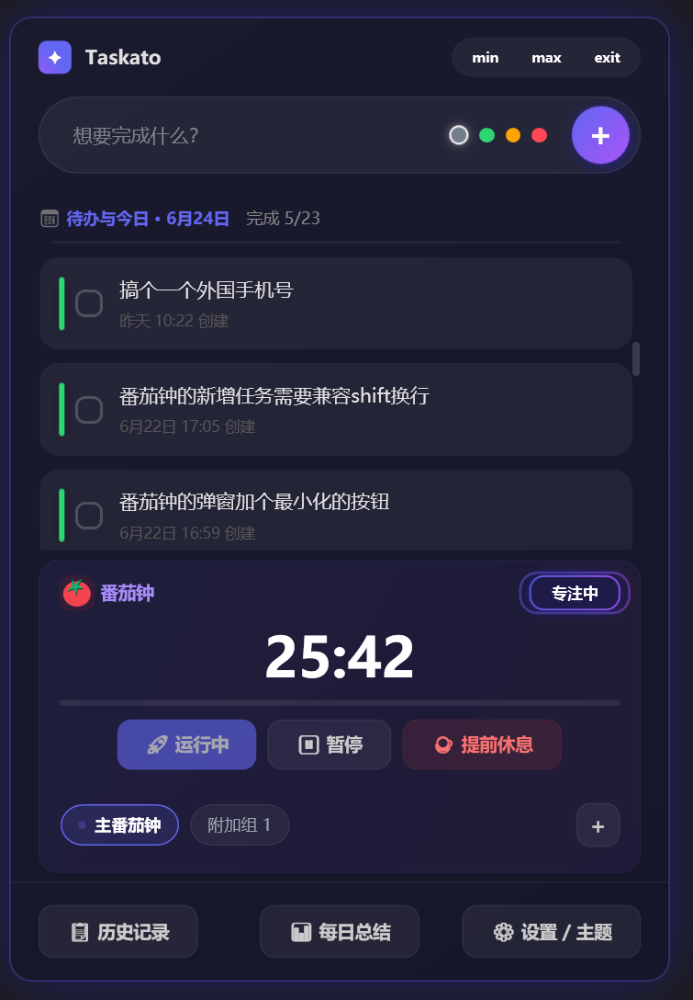

# Taskato

<p align="center">
  
</p>

<h3 align="center">把番茄钟、今日任务、历史复盘放在一个安静好看的 Windows 桌面应用里</h3>

<p align="center">
  <a href="#快速开始">快速开始</a>
  ·
  <a href="#功能亮点">功能亮点</a>
  ·
  <a href="#界面预览">界面预览</a>
  ·
  <a href="#项目结构">项目结构</a>
</p>

<p align="center">
  <a href="https://github.com/quecai-niu/Taskato/commits/master"></a>
  <a href="https://github.com/quecai-niu/Taskato/stargazers"></a>
  <a href="https://github.com/quecai-niu/Taskato/issues"></a>
  <a href="https://github.com/quecai-niu/Taskato"></a>
</p>

---

## 这是什么

Taskato 是一个基于 **.NET 8 + WPF** 的番茄钟与任务管理桌面应用。它不是简单的计时器，而是围绕一天的工作流做了几件事：

- 专注前，把今天要做的事放进任务列表。
- 专注中，用番茄钟保持节奏，支持多组并行计时。
- 专注后，通过提醒弹窗、提示音、飞书通知把状态拉回来。
- 一天结束，用每日总结和历史查询回看完成情况。

## 界面预览

<p align="center">
  
</p>

更多交互预览：

- [番茄钟附加组删除按钮预览](docs/previews/preview_PomodoroTabDelete_20260618_1407.html)
- [番茄钟完成弹窗鎏金边框预览](docs/previews/preview_ToastGoldBorder_20260618_1406.html)
- [番茄钟完成弹窗熔金闪卡预览](docs/previews/preview_ToastGoldHybrid_20260618_1411.html)

## 功能亮点

| 模块 | 能力 |
| --- | --- |
| 番茄钟 | 工作/休息循环、暂停、跳过、提前休息、实时进度条、状态动画 |
| 多组计时 | 主番茄钟 + 附加番茄钟，选项卡切换，附加组支持删除 |
| 任务管理 | 今日任务、4 级优先级、`#标签` 自动解析、详情编辑、完成耗时记录 |
| 提醒弹窗 | 四角轮换出现、鎏金边框、按钮延迟启用、显示已出现时长 |
| 提示音 | 无声、Windows Notify、Ding、Background、Chimes、自定义音效 |
| 飞书通知 | 工作完成、休息完成、休息过半、重复提醒均可配置 |
| 每日总结 | 日期切换、统计数据、复制/导出文本、补录已完成任务 |
| 历史查询 | 日期范围、关键词、完成状态筛选、多字段排序、CSV 导出 |
| 系统集成 | 托盘常驻、最小化后台运行、开机自启、单例运行 |

## 快速开始

### 环境要求

- Windows 10/11
- [.NET 8 SDK](https://dotnet.microsoft.com/download/dotnet/8.0)

### 克隆与运行

```powershell
git clone https://github.com/quecai-niu/Taskato.git
cd Taskato
dotnet run --project src/Taskato/Taskato.csproj
```

### 构建

```powershell
dotnet build Taskato.sln
```

## 使用方式

1. 在主界面添加今日任务，可用 `#标签` 做轻量分类。
2. 设置工作/休息时长，启动番茄钟。
3. 番茄钟结束后，根据弹窗选择休息或继续工作。
4. 打开历史查询或每日总结，回看任务完成情况。
5. 如需远程提醒，在设置中配置飞书 Webhook。

## 技术栈

| 层级 | 技术 |
| --- | --- |
| UI | WPF, XAML, WindowChrome |
| 架构 | MVVM |
| 运行时 | .NET 8, C# |
| 存储 | SQLite, sqlite-net-pcl |
| 系统集成 | Windows Forms NotifyIcon, HKCU Run |
| 通知 | ToastWindow, MediaPlayer/SoundPlayer, Feishu Webhook |

## 项目结构

```text
Taskato/
├─ src/
│  ├─ Taskato/
│  │  ├─ Assets/          # 图标与图片资源
│  │  ├─ Converters/      # XAML 值转换器
│  │  ├─ Models/          # 任务等数据模型
│  │  ├─ Services/        # 数据库、计时器、设置、托盘、飞书通知
│  │  ├─ Utils/           # RelayCommand、视觉效果等工具
│  │  ├─ ViewModels/      # Main、Pomodoro、History、DailySummary
│  │  └─ Views/           # 主窗体、设置、历史、详情、弹窗
│  └─ TestProject/
├─ docs/
│  └─ previews/           # UI 预览与截图
├─ Taskato.sln
└─ README.md
```

## 配置与数据

应用会在运行目录下维护本地数据与设置：

- `Data/settings.json`：主题、番茄钟、提示音、通知等偏好设置。
- SQLite 数据库：任务、历史和每日总结依赖的本地持久化数据。

这些数据默认留在本机，不需要云端账号。

## 当前版本

`v2.13`

- 优化番茄钟完成弹窗四角轮换、鎏金边框和按钮延迟。
- 新增设置页提醒弹窗按钮延迟时长配置。
- 优化附加番茄钟删除按钮悬浮显示效果。
- 新增番茄钟弹窗和附加组删除按钮预览文件及截图。
